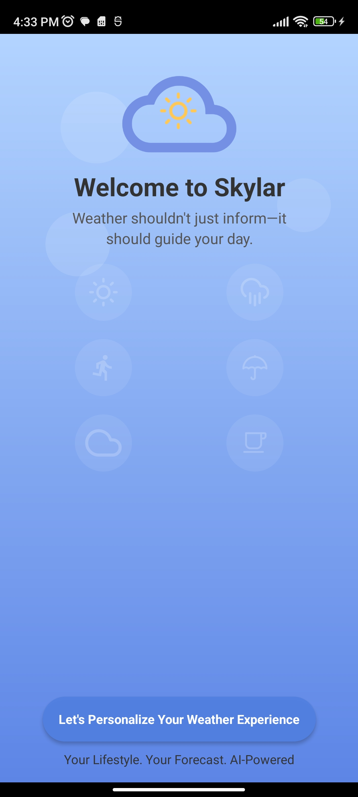
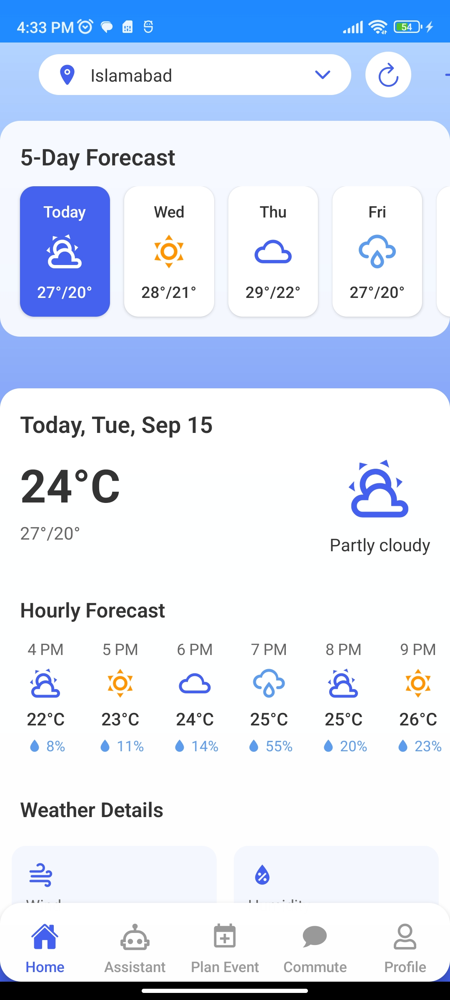
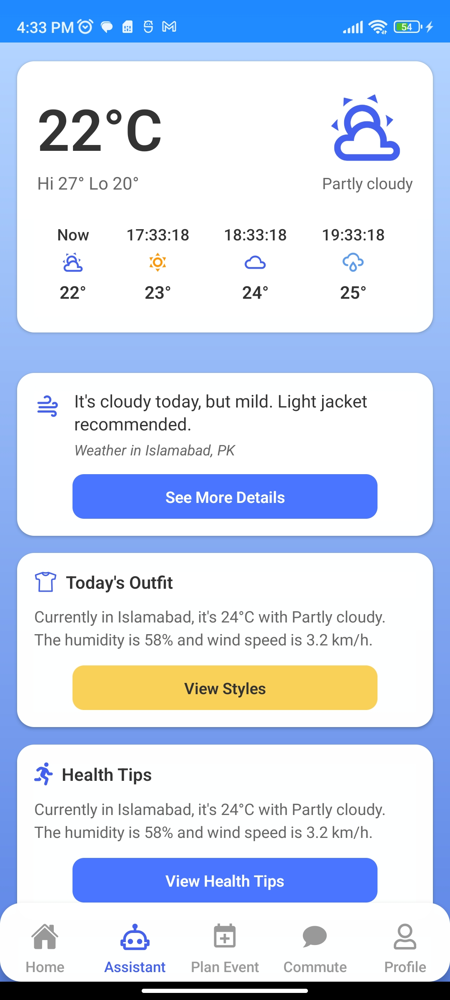
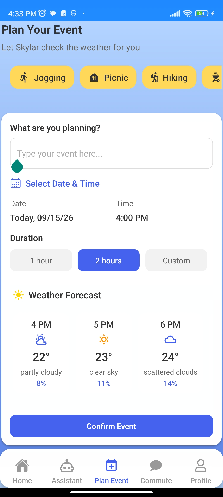
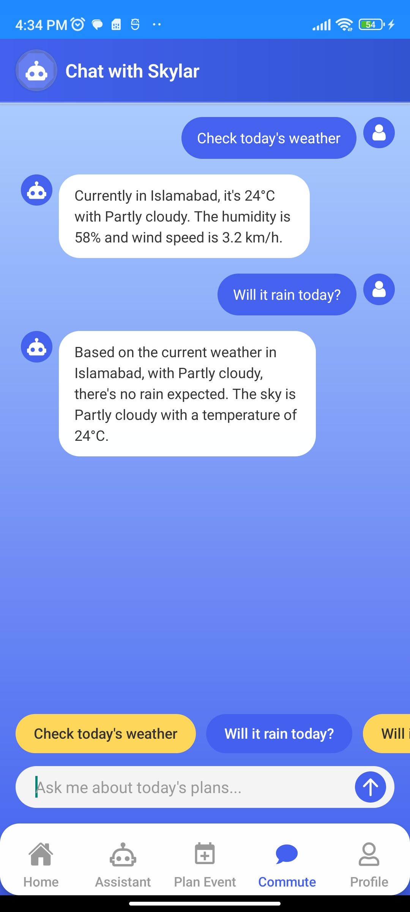
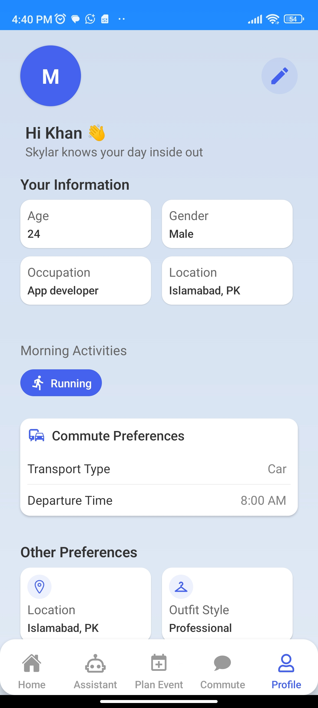

# Skylar — AI Weather Planner

Skylar is a React Native weather companion that combines forecasts with practical, personalized guidance. It includes current conditions, hourly and seven-day forecasts, an assistant, commute advice, event planning, preferences, and local reminders.

This repository is preserved as a portfolio project. The original commercial API trials, model access, Firebase deployment, and advertising configuration are no longer assumed to be available. A built-in demo mode is enabled by default so the main experience remains presentable without paid services or private credentials.

## Features

- Current conditions with temperature, humidity, wind, visibility, pressure, UV index, and precipitation probability
- Hourly and seven-day forecast views
- Weather-aware conversational assistant
- Commute and clothing guidance
- Event planning with local notification reminders
- Saved cities, user profile, routines, preferences, and metric/imperial units
- Offline portfolio demo data and deterministic assistant responses
- Optional legacy Firebase Functions, FCM, OpenWeather, Google Places, Gemini, and AdMob integration points

## Screenshots

| | |
| --- | --- |
| <br />**Splash Screen** | <br />**Home & Forecast Screen** — shows daily weather, 5-day selection slider, 24-hour forecast for the selected day, and weather details |
| <br />**Weather Assistant** — gives clothing, safety, and AI-generated weather suggestions based on user preferences | <br />**Event Planner** — lets users plan events by date/time and receive alerts if weather changes |
| <br />**Commute AI Chat** — allows users to chat with AI about travel and weather-related commute decisions | <br />**Profile Screen** |

## Tech stack

- React Native 0.79 and React 19
- TypeScript and React Navigation
- AsyncStorage, Axios, and Fetch
- Notifee and Firebase Cloud Messaging
- Google Mobile Ads
- Firebase Functions with Node.js
- OpenWeather, Google Places/Geocoding, OpenAI, and Gemini legacy integrations

## Demo mode

Demo mode is controlled by `DEMO_MODE` in `src/config/appConfig.ts` and is `true` by default.

While enabled, Skylar:

- serves local sample current, hourly, and daily weather data;
- provides offline city suggestions;
- answers assistant questions with local weather-aware responses;
- bypasses remote Firebase device registration and push-token calls;
- skips AdMob initialization and native ad requests; and
- starts with Islamabad sample weather available to the shared weather context.

The original service interfaces remain intact, so screens and hooks do not need separate demo implementations. Sample dates and times remain current for natural-looking screenshots.

## Requirements

- Node.js 18 or newer
- Yarn or npm
- Android Studio and an Android emulator/device for Android development
- macOS with Xcode and CocoaPods for iOS development

Follow the official [React Native environment setup guide](https://reactnative.dev/docs/set-up-your-environment) before building the native app.

## Setup

```bash
git clone <repository-url>
cd AIWeatherAPP
yarn install
yarn start
```

In a second terminal, run Android:

```bash
yarn android
```

On macOS, install pods and run iOS:

```bash
cd ios
bundle install
bundle exec pod install
cd ..
yarn ios
```

No API keys are required in demo mode. Complete the short onboarding flow or open the main application through its navigation route to capture populated forecast and assistant screens.

## Optional live integrations

`.env.example` documents the credentials used by the historical integrations. Copy it to `.env` only for local development and use newly issued, restricted credentials. Never commit `.env`, signing keys, service-account files, or production ad identifiers.

The React Native client deliberately keeps empty live placeholders in `src/config/appConfig.ts`; this avoids implying that Metro automatically loads `.env` files. If live mode is restored, connect those values using a maintained React Native environment solution or native build configuration, then set `DEMO_MODE` to `false`.

Firebase Functions read `OPENAI_API_KEY` and `OPENWEATHER_API_KEY` from their runtime environment. Deploying them also requires a Firebase project, Firestore, FCM, billing where applicable, and an updated functions base URL.

## Legacy API status

The app was originally built around paid or trial services. Their previous keys and account configuration have been removed from active source, and the old deployment should be considered unavailable. In particular, OpenWeather One Call 3.0, hosted OpenAI requests, Gemini models, Google Places, FCM, and production AdMob behavior may require renewed accounts, billing, API enablement, and model-version updates.

## Useful commands

```bash
yarn start       # Start Metro
yarn android     # Build and launch Android
yarn ios         # Build and launch iOS (macOS only)
yarn test        # Run Jest tests
yarn lint        # Run ESLint
```

## Security note

Credentials previously committed to a Git repository remain in its history even after removal from the current tree. Any formerly exposed keys should be revoked or restricted. This cleanup intentionally does not rewrite Git history.
